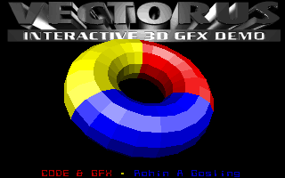
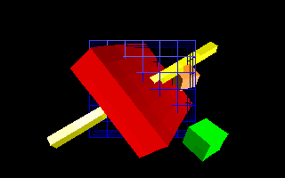
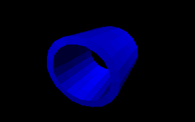
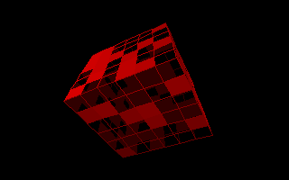
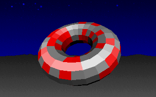
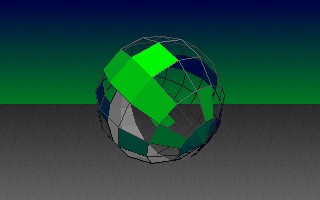

# M3DE (Micro-3D Engine)

A 3D graphics engine for writing mode-13h demos for DOS, written in C++ back in the 90s. Built on top of the [GFX-13](https://github.com/rohingosling/gfx-13) VGA Mode 13h 2D graphics library.

Features:
- Procedural 3D object generation (box, icosphere, geosphere, hemisphere, cylinder, cone, tube, torus, lamina).
- Per-face flat shading with omnidirectional and spot lighting.
- Backface culling and painter's algorithm depth sorting.
- Object, camera, and light transformations.
- Double-buffered rendering with VGA vertical retrace sync.

||||
|:---:|:---:|:---:|
||||
||||

## API

```cpp
// Initialization and cleanup

void InitWorld         ( WORLD  far *world );
void InitObject        ( OBJECT far *object );
void InitFace          ( FACE   far *face );
void InitLight         ( LIGHT  far *light );
void InitCamera        ( CAMERA far *camera );
void InitDepthBuffer   ( WORLD  far *world );

void DestroyFace       ( FACE   far *face );
void DestroyObject     ( OBJECT far *object );
void DestroyWorld      ( WORLD  far *world );

// World construction

void SetNumberObjects  ( int n, WORLD  far *world );
void SetNumberFaces    ( int n, OBJECT far *object );
void SetNumberVertices ( int n, FACE   far *face );
void SetNumberLights   ( int n, WORLD  far *world );
void SetNumberCameras  ( int n, WORLD  far *world );

// Object manipulation

void SetObjectColor        ( int          color,           OBJECT *object );
void SetObjectConstruction ( CONSTRUCTION construction,    OBJECT *object );
void SetObjectShading      ( BOOLEAN      shading_enabled, OBJECT *object );
void FlipNormals           ( OBJECT      *object );

// Object generation

int GenerateBox              ( CALC width, CALC width_grid, CALC height, CALC height_grid, CALC length, CALC length_grid, OBJECT far *object );
int GenerateCone             ( CALC height, CALC radius, int sides, int segments, OBJECT far *object );
int GenerateCylinder         ( CALC height, CALC radius, int sides, int segments, OBJECT far *object );
int GenerateIcosphere        ( CALC radius, int frequency, OBJECT far *object );
int GenerateGeosphere        ( CALC radius, int equatorial_sides, OBJECT far *object );
int GenerateHemisphere       ( CALC radius, int equatorial_sides, OBJECT far *object );
int GenerateTorus            ( CALC inner_radius, CALC outer_radius, int segments, int circle_sides, OBJECT far *object );
int GenerateTube             ( CALC height, CALC inner_radius, CALC outer_radius, int sides, int segments, OBJECT far *object );
int GenerateSquareLamina     ( VECTOR a, VECTOR b, VECTOR c, VECTOR d, int grid1, int grid2, OBJECT far *object );
int GenerateTriangularLamina ( VECTOR a, VECTOR b, VECTOR c, OBJECT far *object );
int GeneratePolygonalLamina  ( CALC radius, int segments, OBJECT far *object );
int GenerateLine             ( VECTOR a, VECTOR b, int segments, OBJECT far *object );
int GeneratePoint            ( VECTOR a, OBJECT far *object );

// Transformation pipeline

VECTOR ObjectTranslation ( VECTOR c, OBJECT object );
VECTOR CameraTranslation ( VECTOR c, WORLD world );
VERTEX ScreenTranslation ( VECTOR c, WORLD world );
CALC   LightTranslation  ( VECTOR n1, VECTOR n2, VECTOR c, OBJECT object, WORLD world );

void TranslateWorld    ( WORLD far *world );
void DisplayWorld      ( WORLD world, unsigned int screen );

// Mathematical utilities

VECTOR GetVector       ( VECTOR a, VECTOR b );
CALC   GetMagnitude    ( VECTOR v );
CALC   GetDistance     ( VECTOR a, VECTOR b );
VECTOR GetNormal       ( VECTOR a, VECTOR b, VECTOR c );
CALC   GetVectorAngle  ( VECTOR u, VECTOR v );
VECTOR GetCenter       ( VECTOR *v, int n );
CALC   GetVisibility   ( VECTOR n1, VECTOR p, WORLD world );
```

## Usage

```cpp
#include "GFX13.H"
#include "M3DE.H"

#define VGA 0xA000

int main ( void )
{
    // Set VGA Mode 13h (320x200, 256 colors)

    SetMode13   ();
    SetClipping ( 0, 0, 319, 199 );

    // Create and configure the 3D world

    WORLD world;

    InitWorld ( &world );

    world.first_color  = 0;
    world.color_length = 32;
    world.xr           = 320;
    world.yr           = 200;
    world.xd           = 160;
    world.yd           = 100;
    world.scale        = 100.0;
    world.xa           = 100.0;
    world.ya           = 100.0;

    // Create an icosphere

    SetNumberObjects ( 1, &world );
    OBJECT far *object = &( world.object [ 0 ] );

    GenerateIcosphere     ( 1.0, 3, object );
    SetObjectColor        ( 2, object );
    SetObjectShading      ( TRUE, object );
    SetObjectConstruction ( SOLID, object );

    object->backface_culling_enabled = TRUE;
    object->visible = TRUE;
    object->yd      = 2.0;

    // Add a light and a camera

    SetNumberLights  ( 1, &world );
    InitLight        ( &world.light [ 0 ] );
    world.light [ 0 ].source.x   = -4.0;
    world.light [ 0 ].source.y   = -2.0;
    world.light [ 0 ].source.z   =  4.0;
    world.light [ 0 ].light_type =  OMNI;
    world.light [ 0 ].enabled    =  TRUE;

    SetNumberCameras ( 1, &world );
    InitCamera       ( &world.camera [ 0 ] );
    world.camera [ 0 ].f = 2.0;
    world.active_camera  = 0;

    InitDepthBuffer ( &world );

    // Render

    TranslateWorld ( &world );
    DisplayWorld   ( world, VGA );

    getch       ();
    DestroyWorld ( &world );
    SetTextMode  ( 25 );

    return 0;
}
```

## Build

Requires [DOSBox](https://www.dosbox.com/) (or real DOS) with Borland Turbo C++ 3.1 on PATH.

```bat
build
```

Compiles `gfx13.c` (C with inline assembly, `-2` for 80186+ instructions), `m3de.cpp` and `test.cpp` (C++), all with the large memory model (`-ml`), then links them into `TEST.EXE`.

### Clean

```bat
build clean
```

Removes build artifacts (`.OBJ`, `.EXE`, `.LOG`).

## Test Program

The included test program (`test.cpp`) is an interactive 3D shape gallery that renders each object type with real-time rotation, lighting, and color cycling.

### Controls

| Key | Action |
|-----|--------|
| `Esc` | Quit |
| `O` | Cycle to next object |
| `Shift+O` | Cycle to previous object |
| `C` | Cycle object color |
| `+` / `-` | Adjust background brightness |
| Arrow keys | Move object (X / Z axis) |
| `Shift` + Up/Down | Move object along Y axis (depth) |

### Objects

| # | Object |
|---|--------|
| 0 | Box |
| 1 | Icosphere |
| 2 | Geosphere |
| 3 | Hemisphere |
| 4 | Cylinder |
| 5 | Cone |
| 6 | Tube |
| 7 | Torus |

## Repository Structure

```
m3de/
├── gfx13.h             GFX-13 header (VGA Mode 13h 2D graphics library)
├── gfx13.c             GFX-13 implementation (C with inline assembly)
├── m3de.h              M3DE header (3D engine structs and functions)
├── m3de.cpp            M3DE implementation
├── test.cpp            Interactive 3D shape gallery
├── build.bat           Build script for BCC 3.1
├── clean.bat           Clean build artifacts
└── images/capture/     DOSBox screenshots
```

## Technical Details

- **Target:** 80186+ real mode, large memory model (`far` pointers, `farmalloc`)
- **Resolution:** 320x200, 256 colors (VGA Mode 13h)
- **Rendering:** Painter's algorithm with per-face depth sorting (`qsort`)
- **Shading:** Per-face flat shading via face-normal-to-light-vector dot product
- **Lighting:** Omnidirectional and spot light types
- **Normals:** Cross-product surface normals with `flip_normal` flag for inner faces (tubes, tori)
- **Geometry:** Procedural generation — all meshes are computed at runtime, no external model files
- **Double buffering:** Off-screen `allocmem` buffer, copied to VGA on vertical retrace
- **Timer:** Sub-tick precision via BIOS tick counter + 8254 PIT channel 0 (frame-rate-independent animation)

## License

This project is provided as-is for educational and archival purposes.
